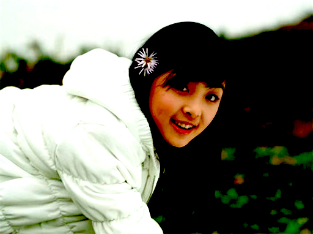
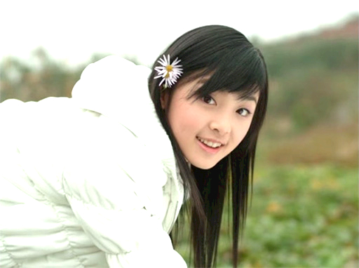
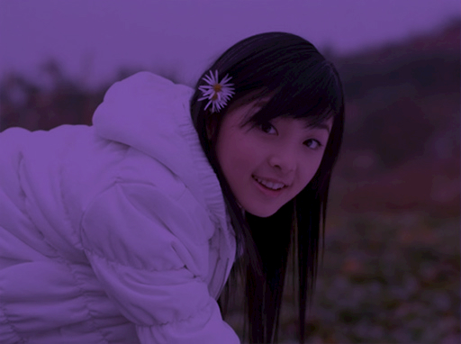
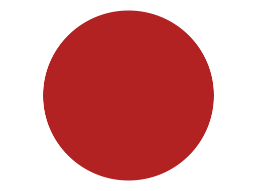

# PlutoFilter

PlutoFilter is a single-header, zero-allocation image filter library written in C. It applies fast, chainable image effects without any dynamic memory allocation. Compatible with SVG and CSS filter semantics, it makes it easy to reproduce visual effects consistently across platforms.

## Installation

PlutoFilter is a self-contained, single-header library written in standard C99. It can be used in two modes: header-only or implementation. In **header-only mode**, simply include the header in any source or header file. This exposes all API declarations but does not include the implementation.

To include the actual implementation, define `PLUTOFILTER_IMPLEMENTATION` in *one* `.c` or `.cpp` file before including the header:

```c
#define PLUTOFILTER_IMPLEMENTATION
#include "plutofilter.h"
```

In all other source files, include the header as usual:

```c
#include "plutofilter.h"
```

The macro `PLUTOFILTER_API` controls the linkage of public functions. By default, it expands to `extern`, but if you define `PLUTOFILTER_BUILD_STATIC` before including the header, all functions will be declared `static` instead. This is useful when embedding the library in a single translation unit to avoid symbol collisions.

## Example

```c
#define PLUTOFILTER_IMPLEMENTATION
#include "plutofilter.h"

// Replace with real image I/O implementations
extern plutofilter_surface_t load_image(const char* filename);
extern void write_image(plutofilter_surface_t surface, const char* filename);

int main(void)
{
    plutofilter_surface_t surface = load_image("input.jpg");

    // filter: contrast(97%) hue-rotate(330deg) saturate(111%)
    plutofilter_color_transform_contrast(surface, surface, 0.97f);
    plutofilter_color_transform_hue_rotate(surface, surface, 330.0f);
    plutofilter_color_transform_saturate(surface, surface, 1.11f);

    write_image(surface, "output.jpg");
    return 0;
}
```

| `input.jpg` | `output.jpg` |
| ----------- | ------------ |
|  |  |

## Features

- [Gaussian Blur](#gaussian-blur)
- [Color Transform](#color-transform)
  - [Grayscale](#grayscale)
  - [Sepia](#sepia)
  - [Saturate](#saturate)
  - [Brightness](#brightness)
  - [Contrast](#contrast)
  - [Opacity](#opacity)
  - [Invert](#invert)
  - [Hue Rotate](#hue-rotate)
  - [Luminance to Alpha](#luminance-to-alpha)
  - [LinearRGB to sRGB](#linearrgb-to-srgb)
  - [sRGB to LinearRGB](#srgb-to-linearrgb)

- [Blend](#blend)
  - [Normal](#blend-normal)
  - [Multiply](#blend-multiply)
  - [Screen](#blend-screen)
  - [Overlay](#blend-overlay)
  - [Darken](#blend-darken)
  - [Lighten](#blend-lighten)
  - [Color Dodge](#blend-color-dodge)
  - [Color Burn](#blend-color-burn)
  - [Hard Light](#blend-hard-light)
  - [Soft Light](#blend-soft-light)
  - [Difference](#blend-difference)
  - [Exclusion](#blend-exclusion)
  - [Hue](#blend-hue)
  - [Saturation](#blend-saturation)
  - [Color](#blend-color)
  - [Luminosity](#blend-luminosity)

- [Composite](#composite)
  - [Over](#composite-over)
  - [In](#composite-in)
  - [Out](#composite-out)
  - [Atop](#composite-atop)
  - [Xor](#composite-xor)
  - [Arithmetic](#arithmetic)

## Roadmap

- [Morphology](https://www.w3.org/TR/SVG11/filters.html#feMorphologyElement)
- [Diffuse Lighting](https://www.w3.org/TR/SVG11/filters.html#feDiffuseLightingElement)
- [Specular Lighting](https://www.w3.org/TR/SVG11/filters.html#feSpecularLightingElement)
- [Convolve Matrix](https://www.w3.org/TR/SVG11/filters.html#feConvolveMatrixElement)
- [Displacement Map](https://www.w3.org/TR/SVG11/filters.html#feDisplacementMapElement)
- [Turbulence](https://www.w3.org/TR/SVG11/filters.html#feTurbulenceElement)

## Gaussian Blur

```c
void plutofilter_gaussian_blur(plutofilter_surface_t in, plutofilter_surface_t out, float std_deviation_x, float std_deviation_y);
````

Applies a Gaussian blur to the input surface using separable convolution. The amount of blur is controlled by the standard deviation along the horizontal and vertical axes. A value of `0` applies no blur.

| `0x0`                                | `5x5`                                | `10x10`                                |
| ------------------------------------ | ------------------------------------ | -------------------------------------- |
|  |  |  |

## Color Transform

```c
void plutofilter_color_transform(plutofilter_surface_t in, plutofilter_surface_t out, const float matrix[20]);
````

Applies a 5×4 color transformation matrix to each pixel in the input surface. The matrix operates on color and alpha channels, allowing both isolated and cross-channel transformations. The input and output surfaces may be the same for in-place filtering.

### Example

```c
const float original[20] = {
    1.0f, 0.0f, 0.0f, 0.0f, 0.0f,
    0.0f, 1.0f, 0.0f, 0.0f, 0.0f,
    0.0f, 0.0f, 1.0f, 0.0f, 0.0f,
    0.0f, 0.0f, 0.0f, 1.0f, 0.0f
};

const float grayscale[20] = {
    0.2126f, 0.7152f, 0.0722f, 0.0f, 0.0f,
    0.2126f, 0.7152f, 0.0722f, 0.0f, 0.0f,
    0.2126f, 0.7152f, 0.0722f, 0.0f, 0.0f,
    0.0f,    0.0f,    0.0f,    1.0f, 0.0f
};

const float sepia[20] = {
    0.393f, 0.769f, 0.189f, 0.0f, 0.0f,
    0.349f, 0.686f, 0.168f, 0.0f, 0.0f,
    0.272f, 0.534f, 0.131f, 0.0f, 0.0f,
    0.0f,   0.0f,   0.0f,   1.0f, 0.0f
};

const float contrast[20] = {
    1.75f, 0.0f,  0.0f,  0.0f, -0.375f,
    0.0f,  1.75f, 0.0f,  0.0f, -0.375f,
    0.0f,  0.0f,  1.75f, 0.0f, -0.375f,
    0.0f,  0.0f,  0.0f,  1.0f,   0.0f
};
```

| `original` | `grayscale` | `sepia` | `contrast` |
|------------|-------------|---------|------------|
|  |  |  |  |

### Grayscale

```c
void plutofilter_color_transform_grayscale(plutofilter_surface_t in, plutofilter_surface_t out, float amount);
````

Applies a grayscale effect to the input surface, controlled by a blending `amount` between the original color and fully desaturated grayscale. A value of `0` preserves the original image, while `1` results in complete grayscale.

| `0` | `0.25` | `0.5` | `0.75` | `1` |
|-----|--------|-------|--------|-----|
|  |  |  |  |  |

### Sepia

```c
void plutofilter_color_transform_sepia(plutofilter_surface_t in, plutofilter_surface_t out, float amount);
````

Applies a sepia tone to the input surface, blending between the original image and a warm, brownish tone. The `amount` controls the intensity, where `0` leaves the image unchanged and `1` applies full sepia coloration.

| `0` | `0.25` | `0.5` | `0.75` | `1` |
|-----|--------|-------|--------|-----|
|  |  |  |  |  |

### Saturate

```c
void plutofilter_color_transform_saturate(plutofilter_surface_t in, plutofilter_surface_t out, float amount);
````

Adjusts the color saturation of the input surface. The `amount` controls how vivid or muted the colors become: `1` leaves the image unchanged, values less than `1` reduce saturation toward grayscale, and values greater than `1` enhance the intensity of colors.

| `1` | `4` | `0.5` | `0` |
|-----|-----|-------|-----|
|  |  |  |  |

### Contrast

```c
void plutofilter_color_transform_contrast(plutofilter_surface_t in, plutofilter_surface_t out, float amount);
````

Adjusts the contrast of the input surface. An `amount` of `1` leaves the image unchanged, values below `1` reduce contrast, and values above `1` increase it. The image is scaled around the midpoint of the color range.

| `1` | `1.75` | `0.5` | `0` |
|-----|--------|-------|-----|
|  |  |  |  |

### Brightness

```c
void plutofilter_color_transform_brightness(plutofilter_surface_t in, plutofilter_surface_t out, float amount);
````

Adjusts the brightness of the input surface. An `amount` of `1` preserves the original brightness, values below `1` darken the image, and values above `1` brighten it uniformly across all color channels.

| `1` | `1.75` | `0.5` | `0` |
|-----|--------|-------|-----|
|  |  |  |  |

### Opacity

```c
void plutofilter_color_transform_opacity(plutofilter_surface_t in, plutofilter_surface_t out, float amount);
````

Adjusts the opacity (alpha) of the input surface. An `amount` of `1` leaves opacity unchanged, while values between `0` and `1` scale the alpha channel linearly. A value of `0` makes the image fully transparent.

| `1` | `0.75` | `0.5` | `0.25` | `0` |
|-----|--------|-------|--------|-----|
|  |  |  |  |  |

### Invert

```c
void plutofilter_color_transform_invert(plutofilter_surface_t in, plutofilter_surface_t out, float amount);
````

Applies a color inversion effect to the input surface. The `amount` controls the strength of the inversion: `0` leaves the image unchanged, `1` fully inverts the RGB channels, and intermediate values blend between the original and inverted colors.

| `0` | `0.25` | `0.5` | `0.75` | `1` |
|-----|--------|-------|--------|-----|
|  |  |  |  |  |

### Hue Rotate

```c
void plutofilter_color_transform_hue_rotate(plutofilter_surface_t in, plutofilter_surface_t out, float degrees);
````

Rotates the hue of each pixel in the input surface by the given angle in degrees. The rotation is applied in the RGB color space, preserving luminance and alpha. A value of `0` leaves colors unchanged, while `360` completes a full rotation back to the original.

| `0°` | `30°` | `90°` | `180°` | `270°` | `360°` |
|------|-------|-------|--------|--------|--------|
|  |  |  |  |  |  |

## Blend

```c
void plutofilter_blend(plutofilter_surface_t in1, plutofilter_surface_t in2, plutofilter_surface_t out, plutofilter_blend_mode_t mode);
````

Blends two surfaces using the specified blend mode. The source surface (`in1`) is blended over the backdrop (`in2`), and the result is written to `out`.

| Mode                                | Input 1                              | Input 2                              | Output                                      |
|-------------------------------------|--------------------------------------|--------------------------------------|---------------------------------------------|
| <a id="blend-normal"></a>Normal     |     |     |      |
| <a id="blend-multiply"></a>Multiply |     |     |    |
| <a id="blend-screen"></a>Screen     |     |     |      |
| <a id="blend-overlay"></a>Overlay   |     |     |     |
| <a id="blend-darken"></a>Darken     |     |     |      |
| <a id="blend-lighten"></a>Lighten   |     |     |     |
| <a id="blend-color-dodge"></a>Color Dodge |  |  |  |
| <a id="blend-color-burn"></a>Color Burn   |  |  |   |
| <a id="blend-hard-light"></a>Hard Light   |  |  |   |
| <a id="blend-soft-light"></a>Soft Light   |  |  |   |
| <a id="blend-difference"></a>Difference   |  |  |   |
| <a id="blend-exclusion"></a>Exclusion     |  |  |    |

## Composite

```c
void plutofilter_composite(plutofilter_surface_t in1, plutofilter_surface_t in2, plutofilter_surface_t out, plutofilter_composite_operator_t op);
```

Composites two surfaces using a Porter–Duff compositing operator. The source surface (`in1`) is composited over the backdrop (`in2`) using the specified operator. The result is written to `out`.

| Operator | Input 1                           | Input 2                      | Output                        |
| -------- | --------------------------------- | ---------------------------- | ----------------------------- |
| <a id="composite-over"></a>Over |  |  |  |
| <a id="composite-in"></a>In     |  |  |  |
| <a id="composite-out"></a>Out   |  |  |  |
| <a id="composite-atop"></a>Atop |  |  |  |
| <a id="composite-xor"></a>Xor   |  |  |  |

### Arithmetic

```c
void plutofilter_composite_arithmetic(plutofilter_surface_t in1, plutofilter_surface_t in2, plutofilter_surface_t out, float k1, float k2, float k3, float k4);
```

Blends two input surfaces using a flexible arithmetic combination of their color values. The output is based on the colors from both inputs, combined according to the four constants: `k1`, `k2`, `k3`, and `k4`.

| Input 1 | Input 2 | k1 | k2 | k3 | k4 | Output |
|---------|---------|----|----|----|----|--------|
|  |  | `0`   | `1`   | `1`   | `0`   |  |
|  |  | `0.5` | `0.5` | `0.5` | `0`   |  |
|  |  | `1`   | `0`   | `0`   | `0`   |  |
|  |  | `1`   | `0`   | `0`   | `0.5` |  |
